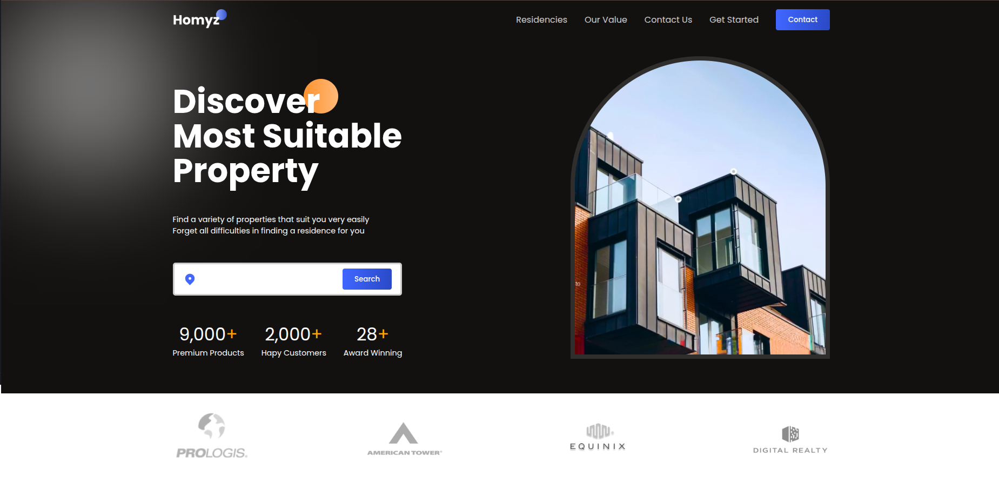

# Real Estate Website



## 📌 About

This project is a real estate website built using **React**. It was developed by following a tutorial by [Zainkeepscode](https://github.com/ZainRk) as part of a learning journey to deepen my understanding of modern web development technologies and practices.

## 🚀 Features

- Modern UI/UX design
- Hero section with search functionality
- Property listings with images and details
- Contact and about sections
- Reusable React components

## 🛠️ Technologies Used

- React
- HTML5
- CSS3
- JavaScript (ES6+)
- Vite (for fast React development)
- React Icons

## 🖥️ Demo

To view a live version locally:

```bash
git clone https://github.com/MOHAJII/Real-Estate-website.git
cd Real-Estate-website
npm install
npm run dev
